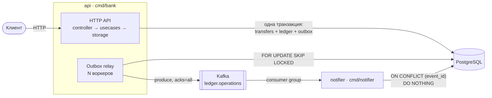
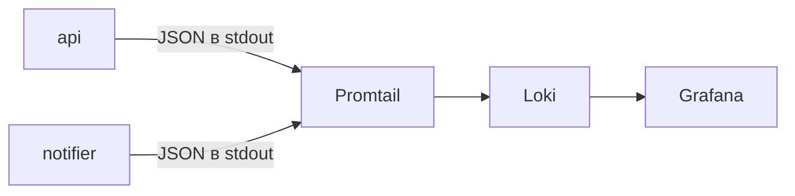

# Mini-bank Ledger

Учебный сервис счетов и переводов на Go. Цель проекта — не продукт, а корректность под конкурентной
нагрузкой: транзакции Postgres, двойная запись (double-entry ledger), идемпотентность API,
transactional outbox и доставка событий через Kafka во второй сервис.

## Архитектура



Путь операции:

1. API меняет балансы, пишет проводки и событие в `outbox` в одной транзакции.
2. Relay забирает неотправленные события из `outbox` и публикует их в Kafka.
3. Notifier читает топик и сохраняет уведомление. Повторно доставленное событие отбрасывается по `event_id`.

Логи обоих сервисов собираются отдельно:



Два бинаря в одном модуле:

- **`cmd/bank`** — HTTP API и outbox relay в одном процессе.
- **`cmd/notifier`** — читает события из Kafka и пишет уведомления в таблицу `notifications`.
- **`cmd/migrate`** — применяет миграции goose (`up` / `down` / `status`).

## Стек

Go 1.26 · chi · pgx v5 (`pgxpool`, без ORM) · goose · franz-go · `log/slog` ·
PostgreSQL 16 · Apache Kafka 3.9 (KRaft, без ZooKeeper) · Loki + Promtail + Grafana · Docker Compose

## Быстрый старт

Для запуска нужен файл `.env` в корне репозитория (в git не входит):

```dotenv
POSTGRES_HOST=localhost
POSTGRES_PORT=5432
POSTGRES_USER=bank
POSTGRES_PASSWORD=bank
POSTGRES_DB=bank

KAFKA_VERSION=3.9.0
KAFKA_HOST_PORT=29092
KAFKA_UI_PORT=8090
KAFKA_BROKERS=localhost:29092
```

Внутри compose `POSTGRES_HOST` и `KAFKA_BROKERS` для api и notifier переопределяются на имена сервисов.

```bash
make up        # собрать и поднять всё окружение
make migrate   # применить миграции (с хоста, через POSTGRES_HOST=localhost)
make logs      # логи api через jq
```

Миграции не запускаются при старте api: после первого `make up` нужен `make migrate`.
До этого relay пишет в лог ошибки об отсутствующей таблице `outbox`.

| Сервис | Адрес |
|---|---|
| API | http://localhost:8080/v1 |
| Kafka UI | http://localhost:8090 |
| Grafana (логи через Loki) | http://localhost:3000 |
| Postgres | localhost:5432 |
| Kafka (с хоста) | localhost:29092 |

Готовые запросы для ручной проверки — в [api.http](api.http) (VS Code REST Client / JetBrains HTTP Client).

Остальные цели Makefile: `run` / `runN` (api / notifier без докера), `api` (пересобрать только api),
`migrate-down`, `stop`, `down`, `test`, `lint`.

## HTTP API

Все мутирующие операции над деньгами требуют заголовок `Idempotency-Key` (UUID).
Суммы — целые числа в минимальных единицах валюты (копейки), `int64`, без float.

| Метод | Путь | Тело | Ответ |
|---|---|---|---|
| `POST` | `/v1/accounts` | — | `201` счёт |
| `GET` | `/v1/accounts/{id}` | — | `200` счёт с балансом |
| `POST` | `/v1/accounts/{id}/deposit` | `{"amount": 500}` | `201` операция |
| `POST` | `/v1/accounts/{id}/withdraw` | `{"amount": 200}` | `201` операция |
| `POST` | `/v1/accounts/transfers` | `{"from": "…", "to": "…", "amount": 100}` | `201` операция |
| `GET` | `/v1/accounts/{id}/history?limit=&cursor=` | — | `200` страница выписки |

Ответ на операцию:

```json
{
  "id": "a3f1…",
  "from_account_id": "…",
  "to_account_id": "…",
  "type": "transfer",
  "amount": 100,
  "status": "completed",
  "created_at": "…",
  "completed_at": "…"
}
```

### Ошибки

Единый формат:

```json
{"error": {"code": "insufficient_funds", "message": "not enough money on the account"}}
```

| HTTP | `code` | Когда |
|---|---|---|
| 400 | `invalid_request` | кривой UUID, тело, сумма ≤ 0, перевод самому себе, кривые `limit`/`cursor` |
| 404 | `account_not_found` | счёта нет |
| 422 | `insufficient_funds` | не хватает денег |
| 422 | `idempotency_key_reuse` | ключ уже использован с другими параметрами |
| 500 | `internal_error` | всё остальное; причина пишется в лог, клиенту не отдаётся |

### История операций

Курсорная (keyset) пагинация по `ledger_entries.id`, от новых к старым. `limit` по умолчанию 20, максимум 100.

```json
{"entries": [ … ], "next_cursor": "88213", "has_more": true}
```

На последней странице `next_cursor` отсутствует, а `has_more` равен `false`. Курсор — `id` последней
отданной записи, поэтому вставка новых операций не сдвигает страницы, а глубина листания не влияет на
скорость. Сервис запрашивает `limit + 1` строк, чтобы узнать `has_more` без `COUNT(*)`.

## Ключевые решения

### Модель данных

| Таблица | Назначение |
|---|---|
| `accounts` | счета; `balance` хранится денормализованно, `CHECK (balance >= 0)` |
| `transfers` | операции deposit / withdraw / transfer; `idempotency_key UNIQUE`, статус `pending → completed \| failed` |
| `ledger_entries` | append-only проводки со знаком (`-` дебет, `+` кредит) и `balance_after` |
| `outbox` | события на отправку в Kafka; частичный индекс `WHERE sent_at IS NULL` |
| `notifications` | уведомления notifier'а; `event_id` — первичный ключ, он же ключ дедупликации |

Корректность `transfers` защищена на уровне схемы: CHECK-ограничение не даст записать deposit со
счётом-отправителем или перевод со счёта на тот же счёт.

### Инварианты

- **Баланс не бывает отрицательным.** Гарантирует `CHECK` в базе, а не проверка в Go. Списание — это
  атомарный `UPDATE ... SET balance = balance - $1`; нарушение ограничения превращается в `422`.
- **Деньги не появляются из ниоткуда.** Перевод пишет две проводки (−N и +N) в одной транзакции вместе
  с изменением балансов. Интеграционные тесты сверяют сумму проводок по счёту с его балансом.
- **Повтор не создаёт вторую операцию** — см. «Идемпотентность».
- **Каждая завершённая операция порождает событие** — см. «Outbox».

### Конкурентность и дедлоки

Уровень изоляции — READ COMMITTED. Отдельных `SELECT … FOR UPDATE` нет: `UPDATE` сам берёт блокировку
строки, а `RETURNING balance` возвращает значение уже после изменения.

Перевод блокирует **два** счёта, поэтому порядок захвата детерминирован: сначала меньший `id`, потом
больший. Без этого встречные переводы A→B и B→A захватывали бы блокировки крест-накрест и ловили
deadlock. Это проверяет тест «friends 200»: 400 встречных переводов параллельно, итоговые балансы и
суммы проводок совпадают.

### Идемпотентность

1. Строка `transfers` со статусом `pending` вставляется **до** транзакции с деньгами, отдельным
   запросом. Она занимает `idempotency_key`: параллельный дубль сразу упирается в `UNIQUE`.
2. При конфликте ключа сервис читает существующую операцию и сравнивает параметры (тип, сумму, счета).
   Совпадают — возвращает исходный результат. Не совпадают — `idempotency_key_reuse`.
3. Движение денег, проводки, перевод в `completed` и запись в outbox идут одной транзакцией.
4. При нехватке средств транзакция откатывается, а операция отдельным запросом помечается как
   `failed` с `error_code = insufficient_funds`. Защита `WHERE status = 'pending'` не даёт затереть
   уже завершённую операцию.

### Outbox и доставка в Kafka

Событие записывается в таблицу `outbox` **в той же транзакции**, что и операция. Поэтому состояния
«деньги ушли, а событие потеряно» не бывает: либо закоммичено и то и другое, либо ничего.

Relay — пул воркеров по тикеру (`RELAY_WORKERS`, `RELAY_PERIOD`). Каждый в своей транзакции:

1. `SELECT … WHERE sent_at IS NULL ORDER BY created_at LIMIT 10 FOR UPDATE SKIP LOCKED` —
   воркеры разбирают разные строки и не ждут друг друга;
2. синхронный produce в Kafka с `acks=all`;
3. `sent_at = now()` для успешно отправленных.

Если процесс упадёт между produce и коммитом, событие уйдёт повторно. Семантика — **at-least-once**,
дубли гасит notifier.

**Ключ сообщения — `account_id`.** Все события одного счёта попадают в одну партицию, поэтому
notifier видит их в том порядке, в каком они произошли. Перевод порождает два события — по одному
на каждый счёт со своим ключом.

### Notifier

- consumer group `notifier`, автокоммит отключён;
- для каждой записи: разбор JSON → текст уведомления → `INSERT … ON CONFLICT (event_id) DO NOTHING`;
- оффсеты коммитятся **после** записи в БД.

Падение до коммита означает повторное чтение. Повторная вставка того же `event_id` ничего не делает —
at-least-once доставка вместе с идемпотентным потребителем дают effectively-once результат.

## Наблюдаемость

Сейчас реализованы **логи**:

- `log/slog` в JSON в stdout;
- middleware `RequestID` берёт `X-Request-Id` из запроса или генерирует его, возвращает в ответе
  и кладёт в контекст логгер с полем `request_id` — оно есть в каждой строке лога запроса;
- access-лог на каждый запрос: `method`, `path`, `status`, `duration_ms`;
- успешные операции логируются в usecase-слое с `transfer_id`, `account_id`, `amount`, `status`;
- Promtail собирает логи контейнеров `api` и `notifier` через Docker API и отправляет в Loki
  с лейблами `service` и `level`; в Grafana Loki подключён как источник данных.

Пример запроса в Grafana → Explore:

```logql
{service="api"} | json | request_id="8b2c…"
```

## Тесты

```bash
make up && make migrate   # интеграционным тестам нужна живая база
make test
```

- **`internal/storage`** — интеграционные тесты против реального Postgres из `.env`. Если база
  недоступна, тесты пропускаются (`t.Skip`), а не падают. Сценарии:
  - успех, повтор с тем же ключом, повтор с другими параметрами, несуществующий счёт — для всех трёх операций;
  - «100 writers» — 100 параллельных пополнений, баланс ровно 100;
  - «100 writers, 99 errors» — 100 параллельных запросов с одним ключом, операция выполнена один раз;
  - «1000 thieves» — 1000 параллельных списаний со счёта с 500, баланс не уходит в минус;
  - «1000 free dollars» — 1000 параллельных переводов, все проходят;
  - «friends 200» — встречные переводы A↔B, без дедлоков, балансы сходятся с ledger.
- **`internal/usecases`** — логика пагинации (`has_more`, курсор, неполная страница).
- **`internal/http/controller`** — отображение доменных ошибок в HTTP-статусы и коды, включая обёрнутые ошибки.

## Структура

```
cmd/
  bank/            HTTP API + outbox relay
  notifier/        Kafka consumer
  migrate/         goose up / down / status
internal/
  app/             сборка зависимостей api, graceful shutdown HTTP-сервера
  config/          конфигурация из env (caarlos0/env + godotenv)
  domain/          сущности, доменные ошибки, событие OperationEvent
  http/
    controller/    хендлеры, валидация, маппинг ошибок
    middleware/    request_id, access log
    route/         маршруты chi
  usecases/        бизнес-логика bank и notifier
  storage/         SQL на pgx: операции, ledger, outbox, notifications
  relay/           outbox → Kafka
  kafka/           обёртки producer / consumer над franz-go
  notifier/        цикл потребления и обработка событий
  logging/         логгер в context
  db/              встроенные миграции goose
deploy/            конфиги Promtail и провижининг Grafana
```

## Конфигурация

| Переменная | По умолчанию | |
|---|---|---|
| `POSTGRES_HOST` / `POSTGRES_PORT` | `localhost` / `5432` | |
| `POSTGRES_USER` / `POSTGRES_PASSWORD` / `POSTGRES_DB` | — | обязательные |
| `POSTGRES_SSLMODE` | `disable` | |
| `POSTGRES_MAX_CONN` | `10` | размер пула |
| `KAFKA_BROKERS` | `localhost:29092` | через запятую |
| `RELAY_WORKERS` | `4` | воркеров outbox relay |
| `RELAY_PERIOD` | `5s` | период опроса outbox |

## Известные ограничения

- **Нет DLQ.** Сообщение, которое notifier не смог обработать, логируется и **коммитится** — то есть
  теряется. Топик `ledger.operations.dlq` запланирован.
- **Зависшие `pending`.** Операция помечается `failed` только при нехватке средств. Если процесс упал,
  отменился контекст или упал коммит, строка остаётся `pending` навсегда, и повтор с тем же ключом
  будет возвращать её. Нужен фоновый reaper.
- **Shutdown не ждёт relay.** Воркеры останавливаются по отмене контекста, но `Run` не дожидается их
  завершения перед закрытием пула и продюсера.
- **Одна партиция.** Топик создаётся автоматически с настройками брокера по умолчанию, поэтому второй
  экземпляр notifier простаивал бы.
- **Нет индекса под выписку.** Запрос истории фильтрует по `account_id` без составного индекса
  `(account_id, id DESC)`.
- **Нет** `/healthz`, `/readyz` и `GET /v1/transfers/{id}`.

## Дальше

- **Наблюдаемость:** метрики Prometheus (RED, бизнес-счётчики, размер неотправленного outbox, лаг
  консьюмера), трейсы OpenTelemetry с передачей контекста через заголовки Kafka — один трейс от
  HTTP-запроса до записи уведомления, дашборд в Grafana.
- **Нагрузка:** nginx с rate limit, graceful shutdown обоих сервисов, k6-сценарии с целью
  1000 RPS и p99 < 100 мс, проверка инвариантов после прогона.
- **Полировка:** строгий golangci-lint, CI.
